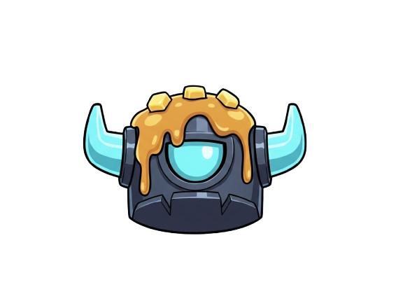
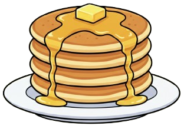
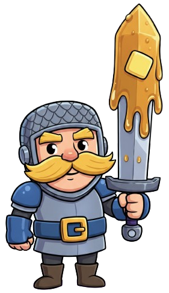
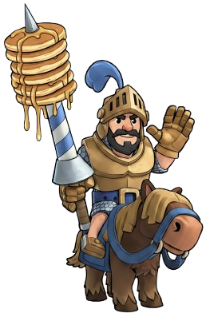
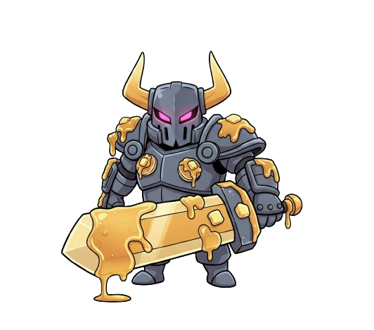
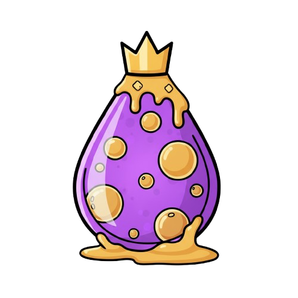
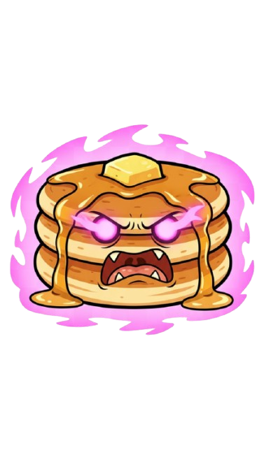
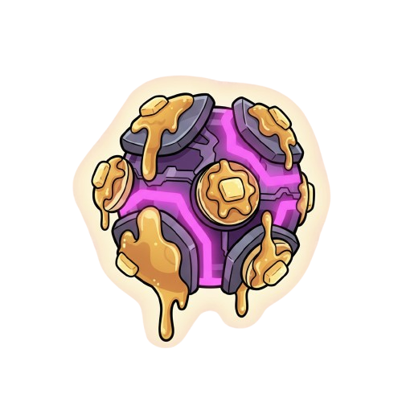

# 🥞 Mini Pekka's Pancake Clicker! 🥞

<div align="center">



**A Clash Royale themed idle clicker game that's absolutely addictive!**

[](https://nextjs.org/)
[](https://www.typescriptlang.org/)
[](https://tailwindcss.com/)
[](https://vercel.com/)

</div>

---

## 🎮 What is Mini Pekka's Pancake Clicker?

An incredibly addictive idle clicker game featuring your favorite Clash Royale characters! Click the pancake to generate delicious treats, unlock powerful upgrades, and build the ultimate pancake empire. With smooth animations, satisfying sound effects, and endless progression, you'll be clicking for hours!

<div align="center">

[](https://minipekka-pancake-clicker.vercel.app/)

**🎮 Click the pancake above!!**

</div>

---

## 🎮 How to Play

1. **Start Clicking**: Click the pancake to generate your first pancakes
2. **Buy Characters**: Use pancakes to purchase character upgrades
3. **Unlock Click Power**: Buy click power upgrades for more per-click value
4. **Achieve Goals**: Complete achievements for bonus rewards
5. **Scale Up**: Keep upgrading to reach astronomical numbers!

### **Pro Tips**
- 💡 **Bulk Buy**: Use 10x or 100x mode for efficient purchasing
- 💡 **Balance**: Mix character upgrades with click power upgrades
- 💡 **Achievements**: Complete achievements for instant pancake bonuses
- 💡 **Patience**: Let passive generation work while you're away!

---

## ✨ Features

### 🥞 **Core Gameplay**
- **Satisfying Clicking**: Click the pancake to generate delicious treats
- **Passive Generation**: Unlock characters that automatically make pancakes
- **Infinite Progression**: No level caps - keep upgrading forever!
- **Bulk Purchasing**: Buy 1x, 10x, or 100x upgrades at once
- **Real-time Updates**: Optimistic UI with server synchronization

### 🎯 **Character Collection**
<div align="center">

| Character | Rarity | Description | Pancakes/Second |
|-----------|--------|-------------|-----------------|
|  **Mini Pekka** | 🟡 Starter | Your loyal pancake-making companion | 1 |
|  **Knight** | ⚪ Common | A brave knight who loves pancake duty | 2 |
|  **Wizard** | 🔵 Rare | A magical wizard who conjures pancakes | 5 |
|  **Baby Dragon** | 🟣 Epic | A cute dragon who breathes pancake fire | 15 |
|  **Prince** | 🟠 Legendary | A royal prince who commands pancake armies | 50 |
|  **P.E.K.K.A** | 🔴 Champion | The ultimate pancake making machine | 200 |

</div>

### ⚡ **Click Power Upgrades**
<div align="center">

| Upgrade | Icon | Description | Click Power Bonus |
|---------|------|-------------|-------------------|
| **Mini Sword** |  | Sharp blade for better clicking | +1 per level |
| **Royal Reinforcement** |  | Elite training for maximum efficiency | +2 per level |
| **Elixir Overclock** |  | Magical elixir boosts your power | +5 per level |
| **Rage Spell** |  | Berserker rage for explosive clicks | +10 per level |
| **P.E.K.K.A Core** |  | The ultimate power source | +25 per level |

</div>

### 🏆 **Achievement System**
- **First Pancake** - Make your first pancake! 🥞
- **Pancake Master** - Make 100 pancakes! 🏆
- **Pancake Legend** - Make 1,000 pancakes! 👑
- **Pancake King** - Make 10,000 pancakes! 👑
- **Pancake Emperor** - Make 100,000 pancakes! 👑
- **Pancake God** - Make 1,000,000 pancakes! 👑

### 🎵 **Audio Experience**
- **Satisfying Sound Effects**: Hear the pancake sizzle every 3 seconds during active clicking
---

## 🚀 Tech Stack

<div align="center">

| Technology | Version | Purpose |
|------------|---------|---------|
|  | 15.5.2 | React framework with App Router |
|  | 5.9.2 | Type-safe development |
|  | 3.3.6 | Utility-first CSS framework |
|  | 12.23.12 | Smooth animations and transitions |
|  | 5.0.8 | Lightweight state management |
|  | 0.543.0 | Beautiful icons |

</div>

---

## 🛠️ Getting Started

### Prerequisites
- Node.js 18+ 
- npm or yarn

### Installation

1. **Clone the repository**
   ```bash
   git clone https://github.com/yourusername/minipekka-pancake-clicker.git
   cd minipekka-pancake-clicker
   ```

2. **Install dependencies**
   ```bash
   npm install
   ```

3. **Run the development server**
   ```bash
   npm run dev
   ```

4. **Open your browser** and navigate to [http://localhost:3000](http://localhost:3000)

### Build for Production

```bash
npm run build
npm start
```

---

## 🎯 Game Mechanics

### **Clicking System**
- **Base Click Power**: 1 pancake per click
- **Upgrade Bonuses**: Add click power through various upgrades
- **Sound Feedback**: Audio plays every 3 seconds during active clicking
- **Visual Effects**: Satisfying animations and glow effects

### **Passive Generation**
- **Character Upgrades**: Each character generates pancakes per second
- **Infinite Levels**: No maximum level cap - keep upgrading forever!
- **Cost Scaling**: Each upgrade costs 15% more than the previous one
- **Bulk Purchasing**: Buy multiple upgrades at once for efficiency

### **State Management**
- **Optimistic Updates**: UI updates immediately for smooth experience
- **Server Synchronization**: Real-time sync with backend state
- **Persistence**: Progress automatically saved and restored
- **Error Handling**: Graceful handling of network issues

---

## 🤝 Contributing

Contributions are always welcome! Here's how you can help:

1. **Fork the repository**
2. **Create a feature branch**: `git checkout -b feature/amazing-feature`
3. **Commit your changes**: `git commit -m 'Add amazing feature'`
4. **Push to the branch**: `git push origin feature/amazing-feature`
5. **Open a Pull Request**

### **Ideas for Contributions**
- 🎨 New character designs
- 🎵 Additional sound effects
- 🏆 New achievement types
- 📱 Mobile UI improvements
- ⚡ Performance optimizations

---

## 📄 License

This project is open source and available under the [MIT License](LICENSE).

---

## 👨‍💻 Author

**Swayam Parekh**
- 🐙 github: [github.com/swyxm](https://github.com/swyxm)
- 📧 email: [swayampa@usc.edu](mailto:swayampa@usc.edu)
- 🎓 [Technology and Applied Computing Program](https://tac.usc.edu/) - ai + cs + ba @ usc

---

## 🙏 Acknowledgments

- **Clash Royale** by Supercell for the amazing character designs and theme
- **Next.js Team** for the incredible React framework
- **Tailwind CSS** for the utility-first CSS approach
- **Framer Motion** for smooth animations
- **Vercel** for seamless deployment

---

<div align="center">

**Made with ❤️ and lots of 🥞**

[](https://github.com/swyxm/minipekka-pancake-clicker)
[](https://github.com/swyxm/minipekka-pancake-clicker)

*Star ⭐ this repository if you enjoyed the game!*

</div>